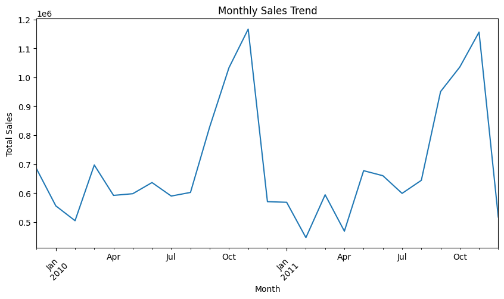
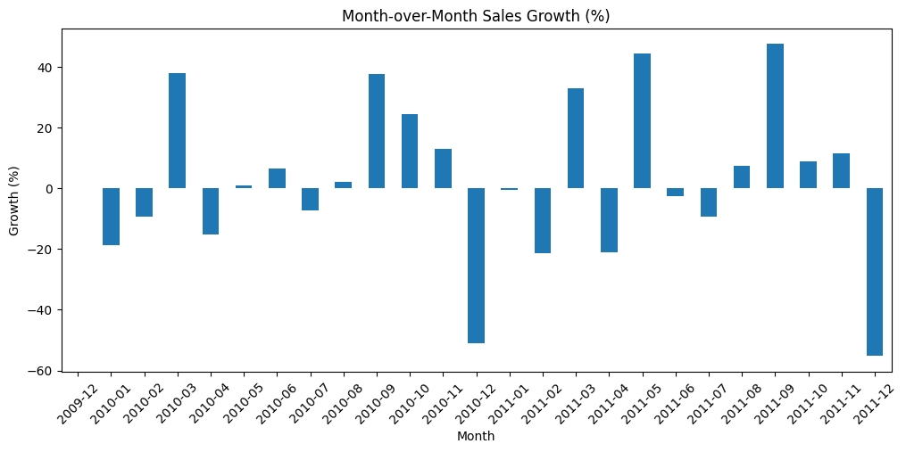
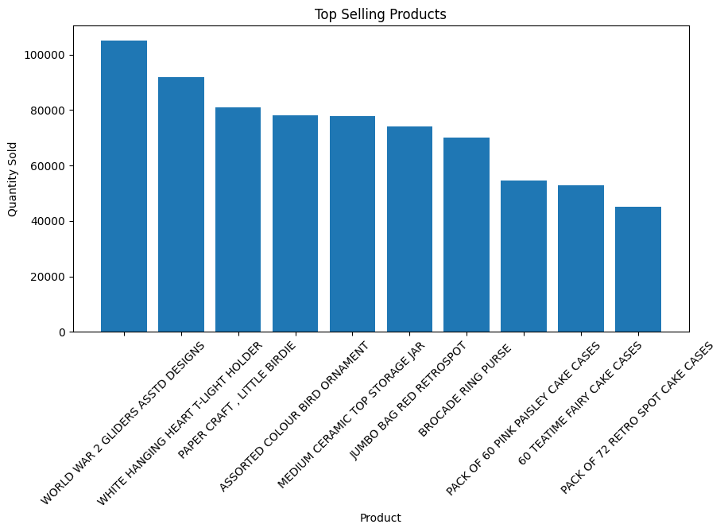
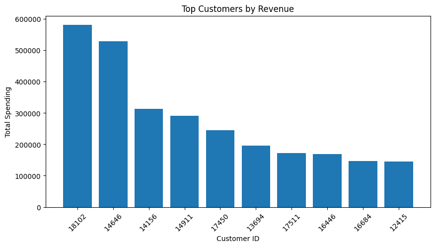
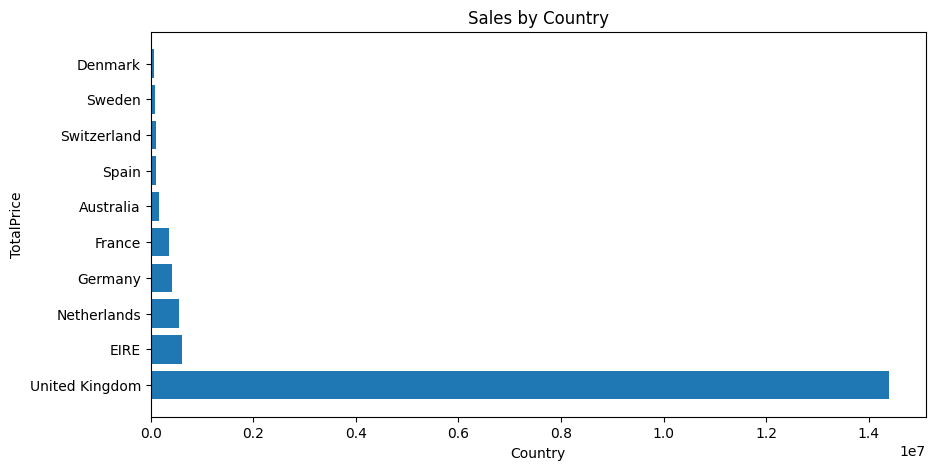
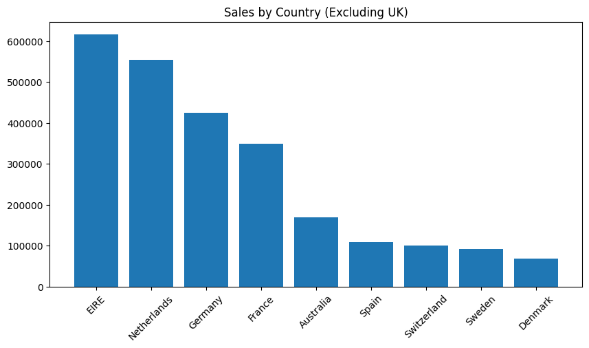

# Customer Sales & Trend Analysis
A data analysis project using Python to uncover sales trends, customer behavior, and business insights from retail data.

## Project Overview
This project analyzes retail transaction data to uncover key business insights, including sales trends, top-performing products, customer behavior, and regional performance.

The goal is to transform raw data into actionable insights that support business decision-making.

---

## Objectives
- Identify seasonal sales trends  
- Determine top-selling products  
- Analyze customer spending behavior  
- Evaluate regional sales performance  

---

## Tools & Technologies
- Python  
- Pandas  
- Matplotlib  
- Jupyter Notebook  

---
## Dataset

-The dataset is not included due to its large size.

-You can download it from:
  https://archive.ics.uci.edu/ml/datasets/online+retail+ii

---

## Data Cleaning
- Removed duplicate records  
- Handled missing values  
- Removed invalid entries (negative quantity and price)  
- Converted data types  
- Created a new feature: `TotalPrice`  

---

##  Key Analysis

### 1. Sales Trend
- Sales show seasonal patterns with peaks in November  
- Indicates strong holiday demand

### 2. Top Products
- A small number of products dominate sales  
- High demand for decorative and gift-related items  

### 3. Top Customers
- Revenue is concentrated among a few high-value customers  

### 4. Sales by Country
- The United Kingdom generates the majority of revenue  
- Other countries contribute significantly less  

---

## Visualizations
The project includes:
- Monthly sales trend (line chart)  
- Top products (bar chart)  
- Top customers (bar chart)  
- Sales by country (bar chart)  
---

## Project Structure
Customer-sales-analysis/
│
├── notebook/
│ └── analysis.ipynb
│
├── visuals/
│ └── (chart images)
│
├── README.md

---

## Skills Demonstrated
- Data Cleaning  
- Data Analysis  
- Data Visualization  
- Business Insight Generation  

---

## Author
Isaak Alemu
